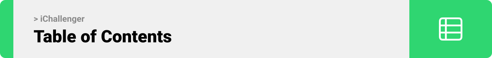
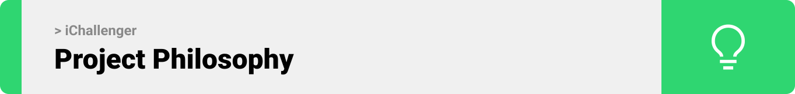
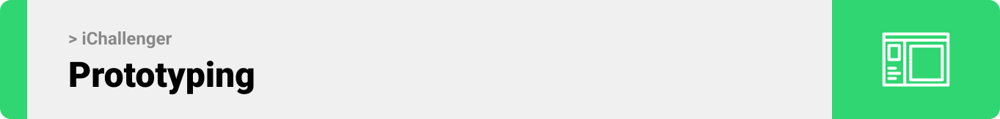
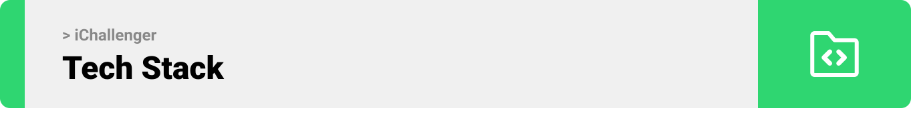
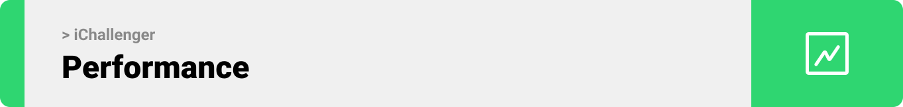

<div style="text-align:center">

> This is the project’s summary that describes the project plain and simple, limited to the space available.

**[PROJECT PHILOSOPHY](https://github.com/alaa-attaya/iChallenger#project-philosophy) • [PROTOTYPES](https://github.com/alaa-attaya/iChallenger#wireframes) • [IMPLEMENTATION](https://github.com/alaa-attaya/iChallenger#demo) • [PERFORMANCE](https://github.com/alaa-attaya/iChallenger#performance)• [TECH STACK](https://github.com/alaa-attaya/iChallenger#tech-stack) • [HOW TO RUN?](https://github.com/alaa-attaya/iChallenger#how-to-run)**

</div>
<br><br>

<!-- project philosophy -->


> iChallenger is a social gaming community and tournament platform that aims to provide players with a dynamic and interactive
> gaming experience where they can compete with others, showcase their skills, earn points and rise up the leaderboards.

### User Stories

- As an Admin, I want to manage players on the platform, so that I can take necessary actions against misconduct.
- As an Admin, I want to add games to the platform, so that users can have forums dedicated to those games.
- As an Admin, I want to create and manage tournaments, so that users can participate in organized competitions and enjoy a competitive gaming experience on the platform.
- As a Player, I want to find and participate in challenges, so that I can progress in the leaderboards.
- As a Player, I want to upload content in the forums so that I can showcase my skills to the community.

<br><br>

<!-- Prototyping -->



> The design was crafted using the Figma app, providing a solid foundation for the project.

### Mockups

| Landing                                 |
| --------------------------------------- |
|  |

| Tournaments                                    | Leaderboard                              |
| ---------------------------------------------- | ---------------------------------------- |
|  |  |

| Tournament Page                            | Profile Page                            |
| ------------------------------------------ | --------------------------------------- |
|  |  |

<br><br>

<!-- Demo -->



| Landing                               |
| ------------------------------------- |
|  |

| Admin: Add Game                        | Admin: Create Tournament                                 |
| -------------------------------------- | -------------------------------------------------------- |
|  |  |

| Admin: User Management                      |
| ------------------------------------------- |
|  |

| Forgot Password                                        |
| ------------------------------------------------------ |
|  |

| Posts                                      |
| ------------------------------------------ | 
|  | 

| Follow                              |
| ----------------------------------- |
|  |

| Messages                                |
| --------------------------------------- |
|  |

| Tournament Invitations                                            | 
| ----------------------------------------------------------------- |
|  | 

| Tournament Completed                                            |
| --------------------------------------------------------------- |
|  |

<br><br>

<!-- Performance -->
<!--  -->

<!-- Tech stack -->


### iChallenger is built using the following technologies:

- This project uses [React](https://react.dev/). React aims to allow developers to create fast user interfaces for websites and applications alike easily.
- This project uses [Electron](https://www.electronjs.org/). Electron simplifies cross-platform desktop app development by leveraging JavaScript, HTML, CSS, and embedded Chromium and Node.js.
- This project uses [Laravel](https://laravel.com/). Laravel is PHP web application framework that is used for developing web applications and APIs.
- To send messages and notifications, the project uses [Pusher](https://pusher.com/). Pusher provides realtime communication between servers, apps and devices.
- To send emails, the project uses [ElasticEmail](https://elasticemail.com/). Elastic Email offers a simple full service platform for Email Marketing and transactional emails.
- This project uses [ChatGPT](https://platform.openai.com/). ChatGPT is employed for user interactions related to games, enhancing interactive conversations and providing intelligent responses specifically in that context.
- For persistent storage (database), the project uses [MySQL](https://www.mysql.com/). The world's most popular open source database.

<br><br>

<!-- How to run -->


> To set up iChallenger locally, follow these steps:

### Prerequisites

- **Git**: You will need Git for version control and to clone the project repository. If you don't have Git installed, you can download and install it from [https://git-scm.com/](https://git-scm.com/).

  Once Git is installed, you'll be able to use Git commands to work with the project repository.

- **XAMPP** (or similar): If your project involves PHP development and requires a web server, you may need XAMPP or a similar web server solution like MAMP or WAMP to set up a local development environment. You can download XAMPP from https://www.apachefriends.org/.

- **npm**: You will need npm (Node Package Manager) to manage project dependencies. If you don't have npm installed, you can install it by running the following command:

  ```sh
  npm install npm@latest -g
  ```

- **Electron**: Make sure you have Electron.js installed globally. You can install it via npm:

  ```sh
  Copy code
  npm install -g electron
  ```

### Installation

1. Get a OpenAI API Key at [https://platform.openai.com/](https://platform.openai.com/)
2. Get a Pusher API Key at [https://pusher.com/](https://platform.openai.com/)
3. Get a ElasticEmail API Key at [https://app.elasticemail.com/](https://app.elasticemail.com/)
4. Clone the repo

   ```sh
   git clone https://github.com/alaa-attaya/iChallenger.git
   ```

5. Install Composer packages
   ```sh
   composer install
   ```
6. Install NPM packages

   ```sh
   npm install
   ```

7. Enter your API in `.env`
   ```env
   OPENAI_API_KEY = ENTER_YOUR_OPENAI_API_KEY;
   PUSHER_API_KEY = ENTER_YOUR_PUSHER_API_KEY;
   ELASTICEMAIL_API_KEY = ENTER_YOUR_ELASTICEMAIL_API_KEY;
   ```
   Now, you should be able to run iChallenger locally and explore its features.
